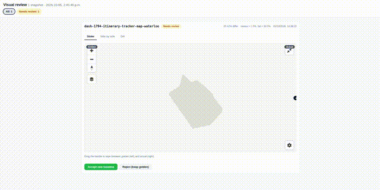

# visual-review

Framework-agnostic visual regression testing for **Playwright** and **Cypress** with the workflow teams actually want:

1. **Tolerance** — per-pixel and whole-image thresholds, so a 1pt font bump doesn't fail the build.
2. **Record, don't fail** — in CI, diffs are recorded and the stage goes `UNSTABLE` instead of red.
3. **One-click review** — an HTML report with a before/after slider, diff highlighting, and Accept/Reject per snapshot.

No external service, no screenshots leaving your network. The comparator is
[`pixelmatch`](https://github.com/mapbox/pixelmatch) (pure JS, antialiasing-aware).



## Why this exists

Our Cypress visual tests had two settings: pass, or fail the build because a
map tile re-rendered. The team did what teams do — tuned thresholds, added
per-suite overrides, wrote "Fix Flaky Snapshots" commits — and the suite kept
crying wolf until nobody trusted red anymore.

The insight: a screenshot diff is rarely binary. A 2% diff on a map is
*suspicious*; an 86% diff on an error page is *broken*. `visual-review`
makes that a first-class distinction with three verdicts — `passed`,
`needs-review`, `failed` — so the middle band goes to a human review queue
instead of failing the build. Suspicious stops meaning broken, and red means
red again.

## Install

```bash
npm install --save-dev @qa-solutions/visual-review
# or point at a tarball: npm install --save-dev ./qa-solutions-visual-review-0.1.1.tgz
```

## Playwright usage

```js
// tests/visual.spec.js
const { test } = require('@playwright/test');
const { visualCheck } = require('@qa-solutions/visual-review/playwright');

test('homepage', async ({ page }) => {
  await page.goto('https://example.com');
  await visualCheck(page, 'homepage');                        // full page
});

test('card component', async ({ page }) => {
  await page.goto('https://example.com');
  await visualCheck(page.locator('.card'), 'card-component', {
    screenshot: { mask: [page.locator('.live-clock')] },       // mask dynamic bits
  });
});
```

`visualCheck(pageOrLocator, name, options)` screenshots, compares against
`visual-snapshots/golden/<name>.png`, and:

- first run → saves the golden, marks `new-baseline` (doesn't fail);
- diff ≤ `reviewThreshold` (default 2%) → `passed`;
- diff ≤ `failThreshold` (default 10%) → `needs-review`: logged, and in strict mode throws;
- bigger diff / size mismatch → `failed`.

When running under `@playwright/test`, actual + diff images are attached to the
HTML report automatically.

### Options (per call, or via env)

| Option | Env | Default | Meaning |
|---|---|---|---|
| `screenshot` | — | `{}` | Playwright screenshot options (`mask`, `fullPage`, `animations: 'disabled'`…) |
| `reviewThreshold` | `VISUAL_REVIEW_THRESHOLD` | `0.02` | diff ratio above → `needs-review` |
| `failThreshold` | `VISUAL_FAIL_THRESHOLD` | `0.10` | diff ratio above → `failed` |
| `pixelThreshold` | `VISUAL_PIXEL_THRESHOLD` | `0.1` | per-pixel color tolerance (kills antialiasing noise) |
| `failOnDiff` | `VISUAL_FAIL_ON_DIFF=false` | `true` | `false` = record-only, never throw |
| `updateBaselines` | `VISUAL_UPDATE_BASELINES=true` | `false` | overwrite goldens instead of comparing |
| `dir` | `VISUAL_REVIEW_DIR` | `visual-snapshots` | storage dir |

## Cypress usage

```js
// cypress.config.js
const { defineConfig } = require('cypress');
const { registerVisualReviewPlugin } = require('@qa-solutions/visual-review/cypress-plugin');

module.exports = defineConfig({
  e2e: {
    setupNodeEvents(on, config) {
      registerVisualReviewPlugin(on, config);
      return config;
    },
  },
});
```

```js
// cypress/support/e2e.js
require('@qa-solutions/visual-review/cypress');

// in a spec
cy.visit('/bookings');
cy.visualCheck('bookings-page');
cy.get('.itinerary-card').visualCheck('itinerary-card'); // element screenshot
```

Same thresholds and env vars as Playwright. In strict mode a `needs-review`/`failed`
result fails the test; with `VISUAL_FAIL_ON_DIFF=false` it just logs.

## The review workflow

After a run, the snapshot dir contains:

```
visual-snapshots/
  golden/      baseline images (commit these)
  actual/      what the last run captured
  diff/        red-highlighted diffs (only for needs-review / failed)
  results.json machine-readable results
  report.html  human review UI
```

**Review in the browser** (one-click accept/reject):

```bash
npx visual-review serve --dir visual-snapshots
# open http://localhost:4567/
```

**Or from the CLI** (works over SSH, in scripts, anywhere):

```bash
npx visual-review report                        # regenerate report.html
npx visual-review accept "bookings-page"        # accept one
npx visual-review accept --all                  # accept everything pending review
npx visual-review reject "bookings-page"        # keep golden, discard this run
```

Commit `golden/` after accepting. That's the whole baseline-update flow.

**The golden rule:** a run never deletes a golden. Only an explicit Accept
(button, CLI) or `VISUAL_UPDATE_BASELINES=true` replaces one.

## Jenkins: never go red on a visual diff

```groovy
stage('Visual tests') {
  steps {
    // Record-only: diffs can't fail the build, the stage just goes UNSTABLE.
    catchError(buildResult: 'SUCCESS', stageResult: 'UNSTABLE') {
      sh 'VISUAL_FAIL_ON_DIFF=false npx playwright test tests/visual.spec.js'
    }
    archiveArtifacts artifacts: 'visual-snapshots/**', allowEmptyArchive: true
    publishHTML(target: [
      reportDir: 'visual-snapshots',
      reportFiles: 'report.html',
      reportName: 'Visual diff review'
    ])
  }
}
```

`publishHTML` is the Jenkins **HTML Publisher** plugin. Reviewers open the build's
"Visual diff review" page, inspect the slider/diff views, and either run
`npx visual-review accept --all` locally (then push the updated goldens) or hit
Accept in `npx visual-review serve`.

To bulk-refresh baselines after an intentional redesign:

```bash
VISUAL_UPDATE_BASELINES=true npx playwright test tests/visual.spec.js
```

## Playwright vs `toHaveScreenshot`

Playwright's built-in `toHaveScreenshot` is great for "fail on any diff" assertions
and has its own `--update-snapshots`. Use `visualCheck` when you want the
**review queue instead of a red build**: thresholds for noise, `needs-review` as a
first-class state, and the accept UI. They compose fine — strict assertions for
critical screens, `visualCheck` for everything else.

## Notes

- `results.json` is read-modify-written per check; for sharded/parallel CI runs,
  point each shard at its own dir (`VISUAL_REVIEW_DIR`) and merge before reporting.
- The Cypress plugin maps screenshots via `cypress/screenshots/<spec>/__vr__/<name>.png`.
- `npx visual-review clean` removes `actual/` and `diff/` but keeps goldens.
